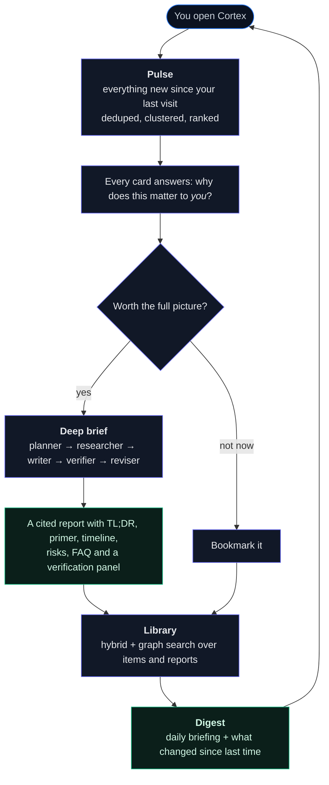
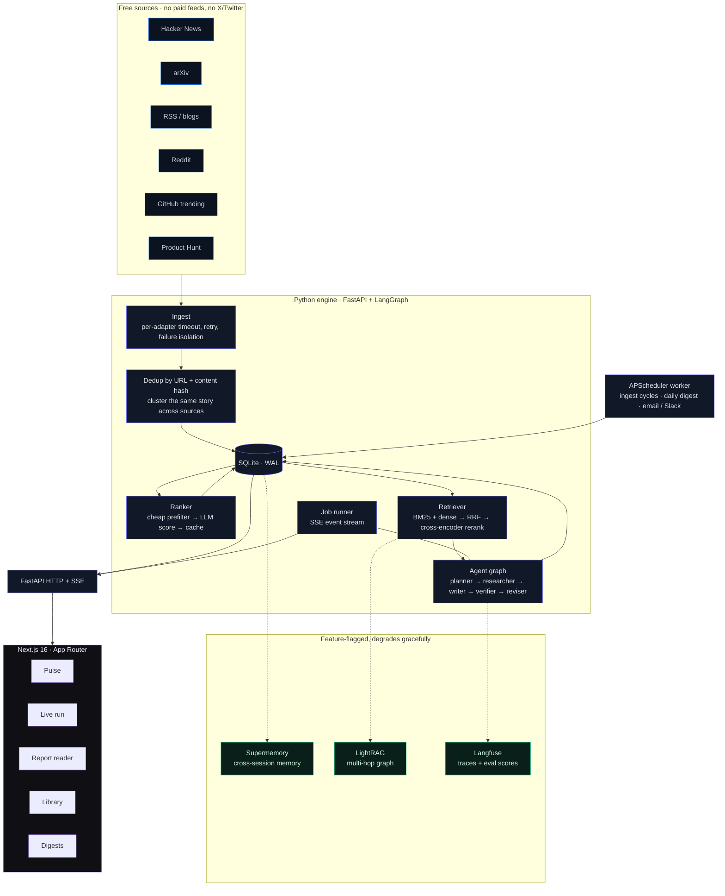
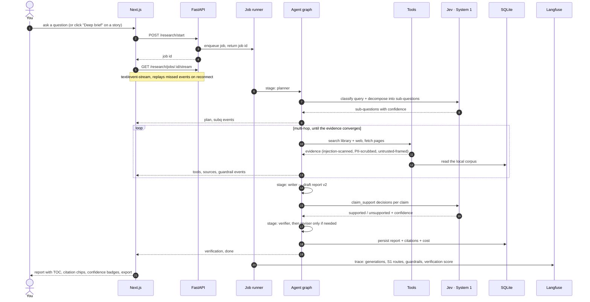
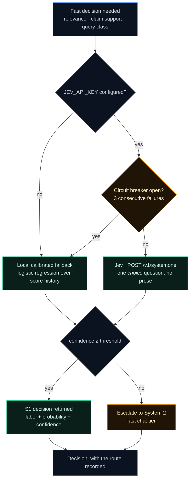
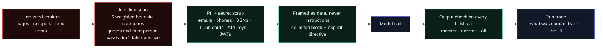
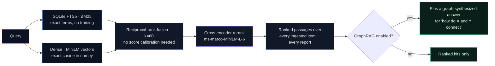
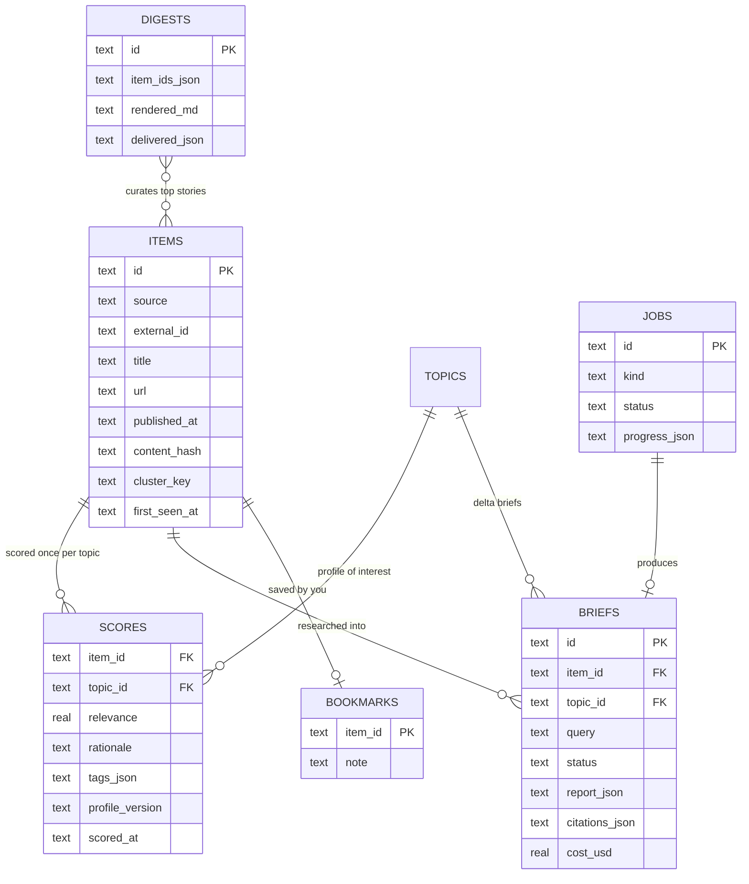

<div align="center">

# CortexResearch

**A market-pulse radar and deep-research engine that reads the internet for you.**

Six free sources in, a ranked and personalized radar out. Click anything and a multi-agent
pipeline researches it, verifies every claim against its citations, and writes a report
detailed enough that you don't have to follow up.

[](https://github.com/Dhruvil-Patel-28/CortexResearch-AI/actions/workflows/ci.yml)


[The problem](#the-problem) · [Architecture](#architecture) · [A research run](#a-research-run-end-to-end) ·
[Under the hood](#under-the-hood) · [Quickstart](#quickstart) · [API](#api-surface)

</div>

---

## The problem

Staying current in tech is a manual job. You open ten tabs, skim the same story
three times, forget what mattered last week, and when something *does* matter you
research it by hand — reading blog posts, cross-checking claims, and still ending
up unsure which source said what.

CortexResearch turns that into a pipeline:

| Manual today | Here |
|---|---|
| Open ten sources | One feed, deduplicated **across** sources (the same story from HN + Reddit + two blogs collapses into one card with 4 source links) |
| Guess what matters to *you* | Every item is scored against your interest profile, with a written "why this matters to you" line |
| Research by hand | A multi-agent run: plan → multi-hop research → write → verify claims → revise |
| Trust the output blindly | Each key development cites its sources; unsupported claims get flagged or removed and the verification panel says which |
| Lose the thread | Everything saved is searchable — hybrid retrieval over every item and every report you have ever generated |

## The daily loop



## Architecture



**Degradation is designed in, not hoped for.** Retrieval still answers if the
embedding model fails to load; a report still ships if the reviser crashes (a
schema-valid fallback is substituted); digests never call an LLM at all; and
GraphRAG, Supermemory and Langfuse are flags the app never hard-depends on.

## A research run, end to end

Nothing about the UI is simulated — the pipeline streams real events as it works.



Under the hood the graph is a LangGraph state machine with a bounded revision
pass — the verifier is authoritative for the final `verification` block, and a
low-confidence group of claims is escalated to the fast chat tier in **one**
call rather than one call per claim.

## Under the hood

<details open>
<summary><b>System 1 / System 2 routing</b> — calibrated decisions instead of prose</summary>

<br/>

Most "AI features" ask a chat model to answer a yes/no question in a paragraph and
then regex the answer out. Here, every fast decision (item relevance, claim
support, query classification) is a **calibrated decision** with a probability
attached — so "unsure" is a first-class outcome that escalates.



- The client speaks the real `/systemone` contract: one named `choice` question in,
  one answer out. The chosen option's probability is the score, Jev's derived
  confidence drives escalation.
- The fallback is a locally-fitted logistic regression over your own score history,
  so the reflex survives Jev being down or unconfigured.
- Every routed decision lands in the run timeline and the report trace — you can see
  *why* something was judged relevant or flagged unsupported.

</details>

<details>
<summary><b>Guardrails on untrusted content</b> — the internet is an injection vector</summary>

<br/>

Every scraped page, search snippet and feed item is hostile until proven otherwise:
a poisoned blog post can tell the model to ignore its instructions.



A deliberate attack corpus and a threshold-gated precision/recall eval keep this
honest: **CI fails if detection regresses**, and the corpus includes near-misses
(articles *about* prompt injection, legitimate PII) so the scanner can't win by
flagging everything.

</details>

<details>
<summary><b>Retrieval</b> — hybrid, reranked, and always local-first</summary>

<br/>



numpy instead of faiss is deliberate at personal-corpus scale: no OpenMP/torch
conflicts, no prebuilt index to go stale. The index is content-addressed and
rebuilds itself when the store changes, so the old "stale prebuilt `faiss_index/`"
failure mode is gone. Both the embedder and the reranker are injectable, which is
how the retrieval tests run with no model download.

</details>

<details>
<summary><b>Data model</b> — one SQLite file, no services to run</summary>

<br/>



Scores are cached by `(content_hash, profile_version)`: edit your interest profile
and everything is re-scored, re-run the same ingest and the ranker makes **zero LLM
calls** (there is a test that asserts exactly that).

</details>

## Engineering highlights

- **Personalization that is actually personal** — a YAML profile (interests, stack,
  goals, boosts, mutes) drives a cheap prefilter (recency + embedding similarity),
  then an LLM scores only the survivors with structured output. Changing the profile
  invalidates the cache via its version hash.
- **Claim-level verification** — each claim's citations are checked deterministically
  first (missing or unknown source id → unsupported, no LLM call), the rest go through
  S1, and the reviser is authoritative for the final verdict.
- **Report schema v2 with self-healing parsing** — output is remapped through field
  aliases and salvaged per entry, so one malformed row can't destroy a report, and a
  failed pipeline still returns something schema-valid instead of an exception.
- **Cost metering** — tiered models (fast tier for scoring/extraction, frontier for
  synthesis), per-run token and dollar accounting surfaced on every report.
- **MCP server** — the whole app over stdio for MCP clients like Claude Desktop:
  `search_library`, `list_items`, `get_item`, `list_reports`, `get_report`,
  `start_research`, `get_research`. The tool core is SDK-free pure functions, so the
  entire surface is unit-testable without the SDK installed.
- **Eval harness** — a precision/recall gate over the injection corpus, plus an
  LLM-as-judge report suite on a four-dimension rubric (groundedness weighted 2×)
  with deterministic facts computed in code rather than asked of a model.
- **Real observability** — every run traces into Langfuse (generations, S1 routes,
  guardrail catches, verification score) via the v4 OTel SDK, and runs identically
  when Langfuse is absent.
- **Offline test suite** — 246 fixture-based tests: no live API, no model download,
  no network. A developer's real API keys can't leak into a test run (the suite
  clears them by construction).

## Stack

| Layer | Choice | Why |
|---|---|---|
| Engine | FastAPI | Async API + SSE streaming without a second framework |
| Agents | LangGraph | Explicit state machine beats an implicit while-loop |
| Storage | SQLite (WAL) + FTS5 | One file, no services, real BM25 |
| Retrieval | numpy + sentence-transformers + cross-encoder | Hybrid + rerank without faiss/torch conflicts |
| Fast decisions | Jev (TypeSafe System One) + local logistic fallback | Calibrated probabilities, not parsed prose |
| Frontend | Next.js 16 · Tailwind v4 · shadcn-style components | Server-rendered shell, streaming views |
| Scheduling | APScheduler | In-process worker, no queue to operate |
| Optional | LightRAG · Supermemory · Langfuse · MCP | All flagged, all optional |

## Quickstart

**Docker** (recommended):

```bash
cp .env.example .env          # set ANTHROPIC_API_KEY
docker compose up --build
# Pulse:     http://localhost:3000
# API docs:  http://localhost:8000/docs
```

**Local dev**:

```bash
python -m venv venv && ./venv/bin/pip install -r requirements.txt
cp .env.example .env          # set ANTHROPIC_API_KEY
./venv/bin/uvicorn api.main:app --port 8000

cd web && npm install && npm run dev   # http://localhost:3001
```

Optional extras:

```bash
./venv/bin/python -m watch.scheduler                      # ingest cycles + daily digest
./venv/bin/python -m mcp_server.server                    # expose to MCP clients (stdio)
./venv/bin/python -m evals.runner                         # guardrail + report evals
```

Digest delivery is layered — the Markdown always lands in `data/digests/`, and the
same digest goes out as HTML + plain-text email and/or Slack when configured:

| Channel | Enable with |
|---|---|
| File | Always on |
| Email | `SMTP_HOST`, `SMTP_USER`, `SMTP_PASSWORD`, `DIGEST_EMAIL_TO` |
| Slack | `SLACK_WEBHOOK_URL` |

With Gmail, use a 16-character [App Password](https://myaccount.google.com/apppasswords),
not your login password. Port 587 upgrades with STARTTLS, 465 uses implicit SSL, and a
failed send never blocks the digest.

## API surface

<details>
<summary>Endpoints (all JSON; <code>/research/jobs/&#123;id&#125;/stream</code> is SSE)</summary>

<br/>

| Method | Path | Purpose |
|---|---|---|
| `GET` | `/watch/feed` | Ranked items (window, source, topic, score filters) |
| `GET` | `/watch/items/{id}` | Item detail + cross-source coverage |
| `POST` | `/watch/items/{id}/bookmark` | Save / unsave |
| `GET` | `/watch/profile` · `POST` `/watch/refresh` · `GET` `/watch/jobs/{id}` | Interest profile · manual ingest · job state |
| `GET` | `/watch/stats` | Corpus and score counts for the UI |
| `POST` | `/research/start` | Start a research job |
| `POST` | `/research/items/{id}/brief` | Deep brief for a story |
| `GET` | `/research/jobs/{id}` · `/research/jobs/{id}/stream` | Job state · live SSE events (replays past events to late subscribers) |
| `GET` | `/research/reports` · `/research/reports/{id}` | Report library · full report |
| `DELETE` | `/research/reports/{id}` | Delete a report |
| `GET` | `/research/reports/{id}/export` | Markdown / PDF export |
| `GET` | `/digests/preview` · `/digests/{id}` | Digest preview · stored digest |
| `POST` | `/digests/run` · `/digests/delta` | Build now · delta brief on a topic |
| `GET` | `/search` | Hybrid search over items + reports (+ graph answer) |
| `GET` | `/health` | Health, including which S1 backend is live |

</details>

## Project structure

```
sources/     feed adapters (HN, arXiv, RSS, Reddit, GitHub, Product Hunt) + shared base
store/       SQLite persistence: items, scores, topics, briefs, digests, jobs, bookmarks
watch/       interest profile, ranker + score cache, dedup/clustering, digest, scheduler
rag/         hybrid retriever (BM25 + dense + RRF + rerank) + optional LightRAG adapter
agents/      LangGraph pipeline: planner, researcher, writer, verifier, reviser + jobs
utils/       config, LLM tiers + JSON calls, System 1 routing, tracing, cost meter
guardrails/  injection scanner, PII/secret scrubber, output policy, run trace
evals/       guardrail gate + LLM-as-judge report suite + CLI runner
memory/      optional Supermemory client, write hooks, research recall
mcp_server/  stdio MCP server: 7 tools over the store and job runner
api/         FastAPI routes: /watch, /research (+SSE), /digests, /search, /health
web/         Next.js 16 frontend (App Router, Tailwind v4)
tests/       offline fixture-based test suite (246 tests)
docs/        design specs for each phase
```

## Status

Actively developed. Roadmap: trends/momentum view, command palette, audio briefings,
multi-user accounts.

Every phase has a written design spec in `docs/superpowers/specs/`, and each one landed
with its tests: source intake, personalization, the report engine, streaming jobs,
digests, guardrails, evals, tracing, System 1 routing, memory, GraphRAG and the MCP server.
